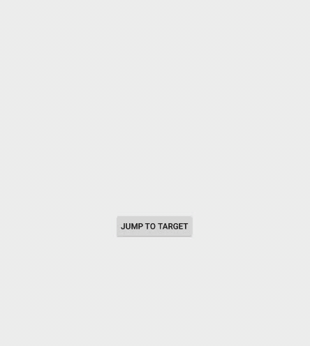
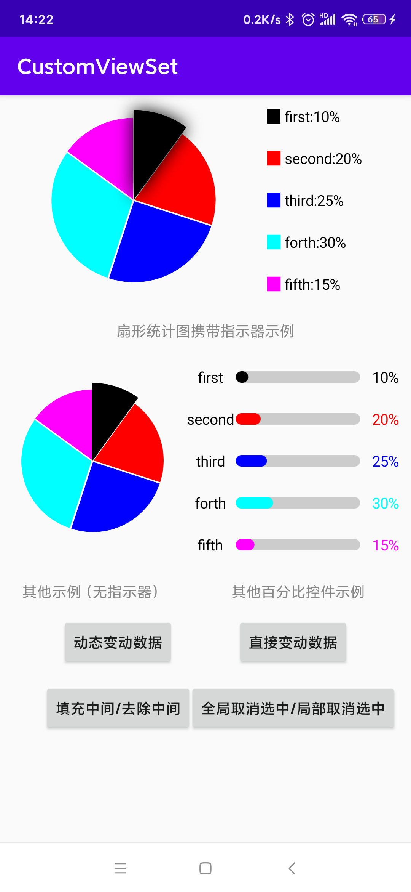
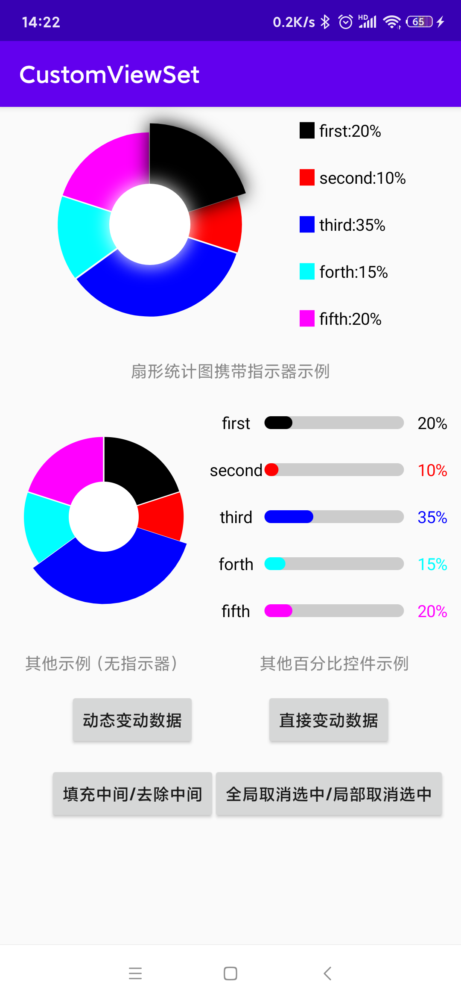

# 百分比型数学统计图
这里的百分比型统计图，特指扇形统计图，当然也适用于类似进度条等这样的百分比型的图表。

## 实际效果

  

## 使用步骤：

使用样例代码见[演示代码](sample)

- 1.创建布局，并引用扇形控件，目前提供两种类型的扇形统计图：[同时增长初始化的扇形图](type/sector/view/GrowAlongSectorView.kt)
和[旋转扫描初始化的扇形图](type/sector/view/SweepSectorView.kt)，这两个类型目前都是抽象类型，需要你指明[PercentInfo](type/sector/percentinfo/PercentInfo.kt)的具体类型（考虑
到可能每个扇形块所携带的信息可能不止当前的[PercentInfo](type/sector/percentinfo/PercentInfo.kt)所提供的参数信息，因此提供拓展能力）。当然内部有SimpleGrowAlongSectorView和
SimpleSweepSectorView可供直接类型是PercentInfo类型的情况使用。
- 2.由于扇形控件并不需要你想使用什么类型的指示器，而且指示器怎么对应到具体的扇形块上，因此这需要你继承[SectorIndicatorView](type/sector/view/indicator/SectorIndicatorView.kt)
指明你想使用的指示器类型(目前默认是颜色块指示器类型)，当然，当你要使用的指示器类型是颜色块指示器类型，且分块信息类型直接是PercentInfo的话，可以直接使用SimpleIndicatorView。目前提供了两类指示器：[颜色块指示器](type/sector/entity/indicator/CakeIndicator.kt)和[图标指示器](type/sector/entity/indicator/IconIndicator.kt)，如果
当前指示器不满足您的要求，需要自行拓展。
- 3.在创建完自定义的指示器之后，你需要扇形绑定该指示器
- 4.为扇形统计图添加数据，之后调用统计图的dataReady()方法以触发动画初始化（不直接在用户填入数据后直接初始化的原因在于，如果一个页面存在多个扇形图，那么调用的先后
将会导致扇形动画变动的先后，效果整体上较乱，如果单独由用户触发，那么可以在用户准备好所有扇形的数据之后，同时触发初始化）

##### 额外说明
目前扇形块选择后会高亢显示，取消选择则是点击当前扇形块控件的空白区域即可。如果需要针对整个屏幕的生效，请选择[ClearFocusConstraintLayout](type/sector/ClearFocusConstraintLayout.kt)作为最上层
的父布局，并关联相关的扇形自定义控件，具体示例，见[样例代码](sample)