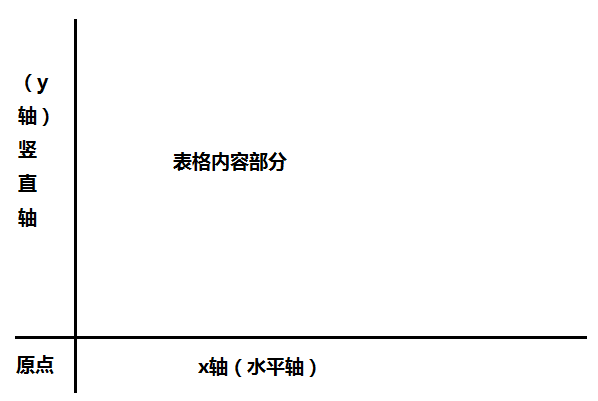
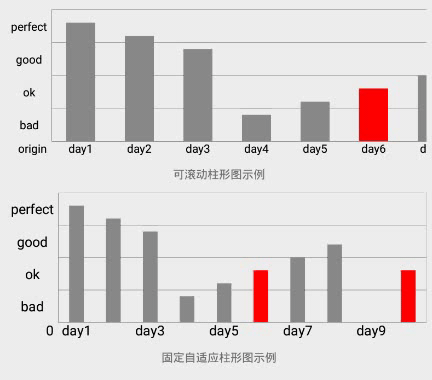
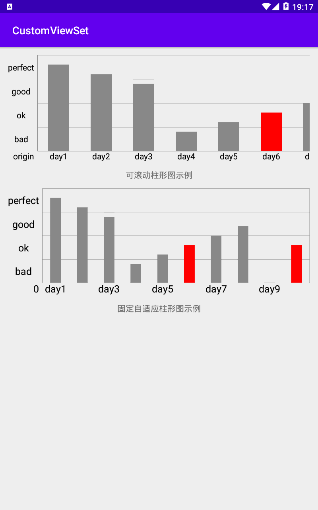

# 表格型数学统计图
[表格型数学统计图](AbsMathDiagramView.kt)是针对包含了x轴（或者水平轴）、y轴（或者竖直轴）、原点和表格内容部分的数学统计图的抽象。如下图所示:

在我们的[代码](AbsMathDiagramView.kt)中，也是按照这种方式，将整个数学表格型统计图抽象成四个部分，每个部分本身赋予android的view的绘制的特性，这里
我们称之为[元素](interfaces/IElement.kt)，每个元素都具备绘制自身的能力（因为实际上四个块都是一个矩形区域，因此绘制时给定其宽高，以避免越界绘制）。
四个具体元素各自拥有各自的要求，[水平轴或x轴](interfaces/IHorizontalAxis.kt)需要给统计图提供它的高度，这样我们才能具体知道表格部分或竖直轴（y轴）的
高度；[竖直轴或y轴](interfaces/IVerticalAxis.kt)需要给统计图提供它的宽度，这样我们根据统计图getWidth()减去竖直轴的宽度，就能知道表格部分或水平轴(x轴)的
宽度；[原点](interfaces/IOrigin)则就是水平轴的高度和竖直轴的高度决定了它。
## 统计图抽象
[统计图抽象](AbsMathDiagramView.kt)是对所有类似统计图（柱形图、折线图等）的统一抽象，实现者需要给定其上面提及的四个轴的实现即可。统计图本身支持滚动，
以适应数据量很大的情况，滚动的实现主要是依赖[canvas](https://developer.android.com/reference/android/graphics/Canvas)的translate方法结合view的onTouchEvent
事件实现的，同时考虑到控件可能被嵌入ScrollView这种竖直滚动的控件而发生事件滑动冲突的情况。

另外，由于用户快速滚动的情况下，一般像系统的滚动性控件都会存在一个惯性滚动，而上面的实现仅仅只在用户拖拽的情况下发生滚动。因此控件本身也考虑到这点，支持了
惯性滚动，主要实现是通过属性动画的特性完成的，更多细节，请查阅[代码](AbsMathDiagramView.kt)
## [柱形图](pillar)
通过上面的抽象，那么柱形图的实现就很简单了。为了支持更多的特殊情况，柱形图支持配置多种属性：
- 每个数据占据的宽度（仅在选择使用[滚动型柱形图](pillar/ScrollablePillarView.kt)生效）
- 柱子绘制的实际占比（即实际柱形的宽度是上面属性的比例）
- 横坐标显示标题的间隔数
- 数据最小值
- 原点位置内容
- 柱子的默认颜色
- 柱子的高亢颜色（需要设置高亢的下标）
- 是否绘制表格线
- 字体大小
等等。
### 实际效果
[演示代码](TableDiagramActivity.kt)

