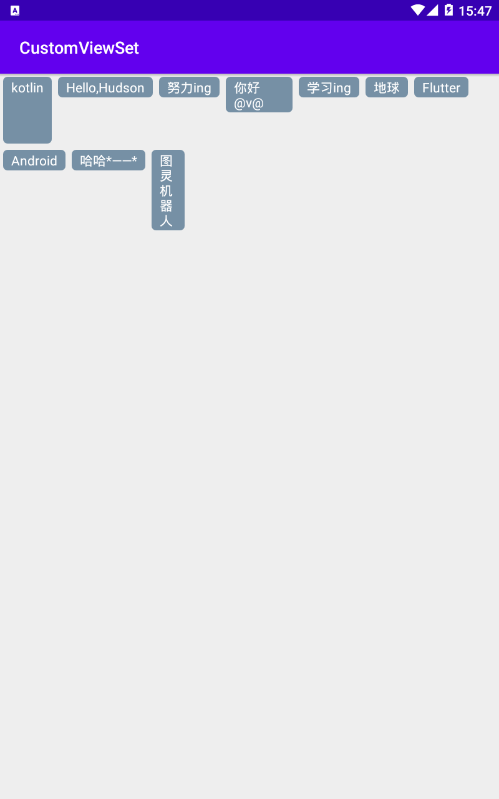

# WrapLayout
按照顺序从左到右、从上到下排列的layout，有点类似Flutter的[Wrap](https://api.flutter.dev/flutter/widgets/Wrap-class.html)

目前该控件被使用在[WanAndroidJetpack](https://github.com/HudsonAndroid/WanAndroidJetpack)搜索历史、体系页面中。

## 展示
